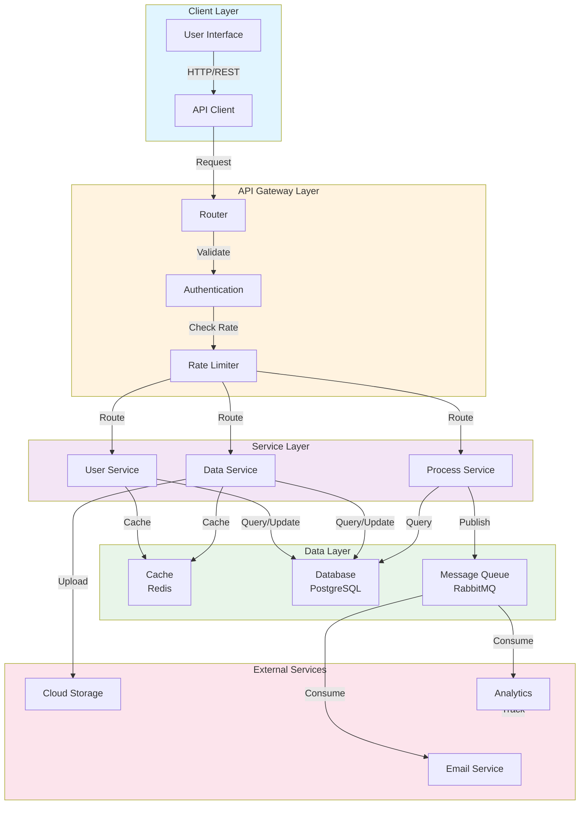

# Architecture Overview

This document provides a visual overview of the system architecture.

## System Architecture Diagram

## Component Descriptions

### Client Layer
- **User Interface**: Frontend application or web interface
- **API Client**: Client library for consuming API endpoints

### API Gateway Layer
- **Router**: Directs incoming requests to appropriate services
- **Authentication**: Handles user authentication and authorization
- **Rate Limiter**: Enforces API rate limits

### Service Layer
- **User Service**: Manages user accounts and profiles
- **Data Service**: Handles data operations and transformations
- **Process Service**: Manages background processes and workflows

### Data Layer
- **Cache**: Redis for fast data access
- **Database**: PostgreSQL for persistent data storage
- **Message Queue**: RabbitMQ for asynchronous messaging

### External Services
- **Email Service**: Sends email notifications
- **Cloud Storage**: Stores files and media
- **Analytics**: Tracks user behavior and metrics

## Data Flow

1. **Request Flow**: Requests come from the client through the API Gateway
2. **Processing**: Services process requests and interact with data layer
3. **Async Operations**: Long-running operations are queued for processing
4. **External Integration**: External services are called as needed for specialized tasks

## Technology Stack

- **Frontend**: User interfaces and client applications
- **Backend**: RESTful API services
- **Database**: PostgreSQL for relational data
- **Caching**: Redis for performance optimization
- **Messaging**: RabbitMQ for event-driven architecture
- **Cloud**: Cloud storage for file management

---

For detailed implementation information, refer to specific service documentation.
